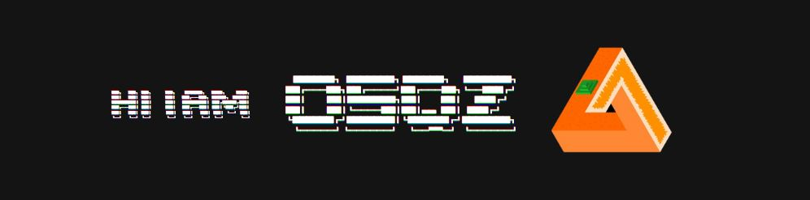

  

# O-SQZ | Kim Juhyeong

I assess security vulnerabilities and turn repetitive work into tools. 
This space is for web, mobile, and AI security tools and public work notes.

[Portfolio](https://o-sqz.github.io/portfolio/) · [Security Blog](https://o-sqz.tistory.com/)

## Selected Work

<table width="100%">
  <thead>
    <tr>
      <th width="35%">Project</th>
      <th width="65%">Description</th>
    </tr>
  </thead>
  <tbody>
    <tr>
      <td><a href="https://github.com/O-SQZ/pentri">PenTri</a></td>
      <td>Chrome extension for collecting and organizing information during manual web security assessments</td>
    </tr>
    <tr>
      <td>OvenForge</td>
      <td>Android security assessment tool for ADB connectivity, project management, and basic static analysis</td>
    </tr>
    <tr>
      <td><a href="https://github.com/O-SQZ/Top10-Mapping-Reporter">Top10 Mapping Reporter</a></td>
      <td>CLI tool that checks observable web security settings and maps the evidence to OWASP Top 10 2025 categories</td>
    </tr>
    <tr>
      <td><a href="https://github.com/O-SQZ/Top10-ko">OWASP Top 10 2025 Korean Translation</a></td>
      <td>Korean translation contribution to OWASP Top 10 2025</td>
    </tr>
  </tbody>
</table>
